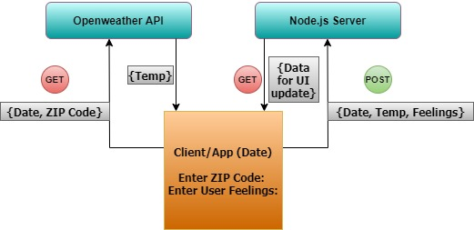

# Weather-Journal App Project

## Overview
This project illustrates an asynchronous web app that uses Web API and user data to dynamically update the UI. 

## About the Project
We combine data from the OpenWeatherMap API and client side (browser) HTML forms to create a web app that records a weather journal for users. This project demonstrates an asynchronous web app that uses Web API and user data to dynamically update the UI for a Weather Journal App.

## Instructions
We set up a Node and Express environment to develop web applications on our local machine, and handle HTTP Requests & Routes. Using the GET/POST request we update and modify website elements dynamically using asynchronously retrieved data.
Server side code is written in `server.js` file and the `website/app.js` file has the client side javascript functions.

 

## Development Strategy

* Start by setting up the project environment using Node Package Manager
* Add a GET route that returns the projectData object in your server code
* Acquire API credentials from OpenWeatherMap website
* After successful retrieval of the weather data, we chain another Promise that makes a POST request to add the API data, as well as data entered by the user, to our app.
